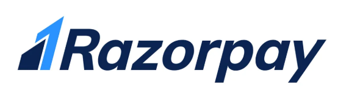
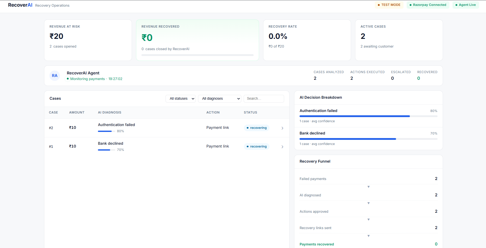
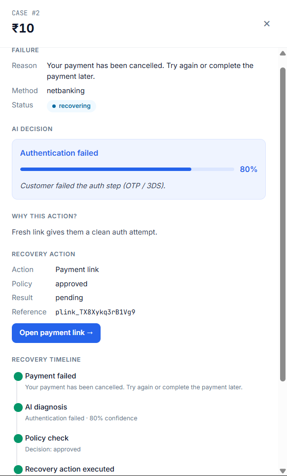
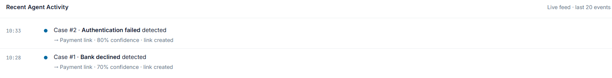
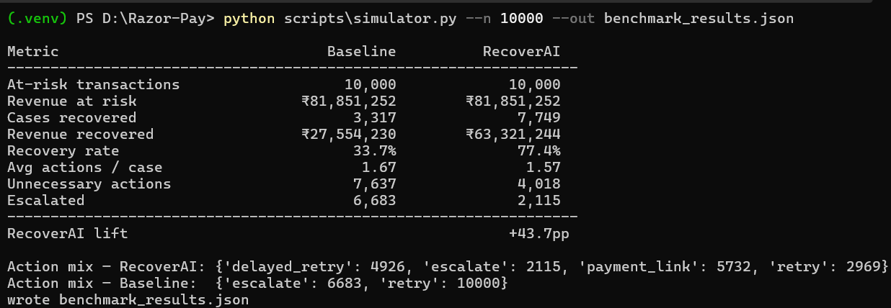
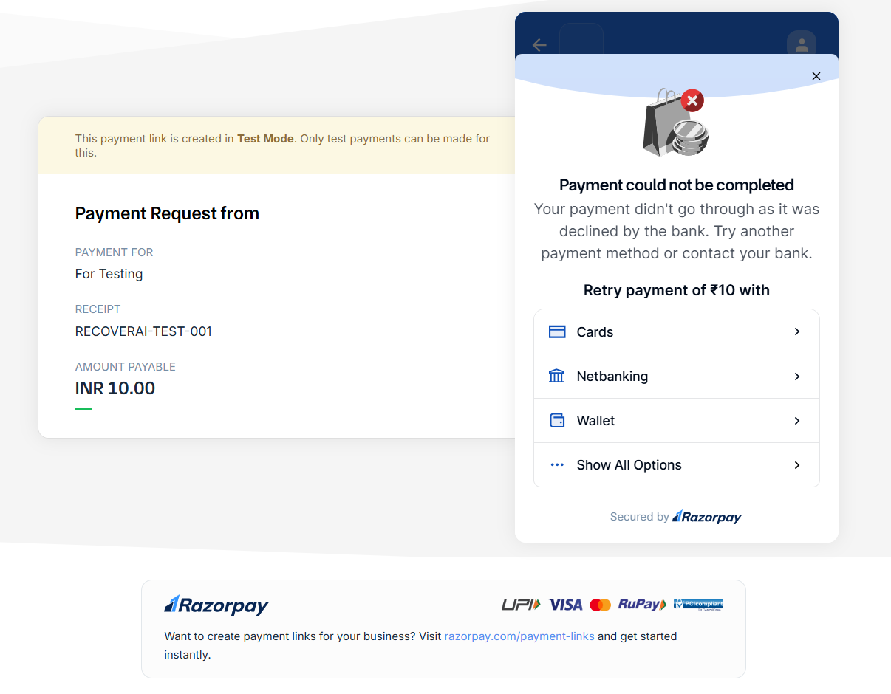
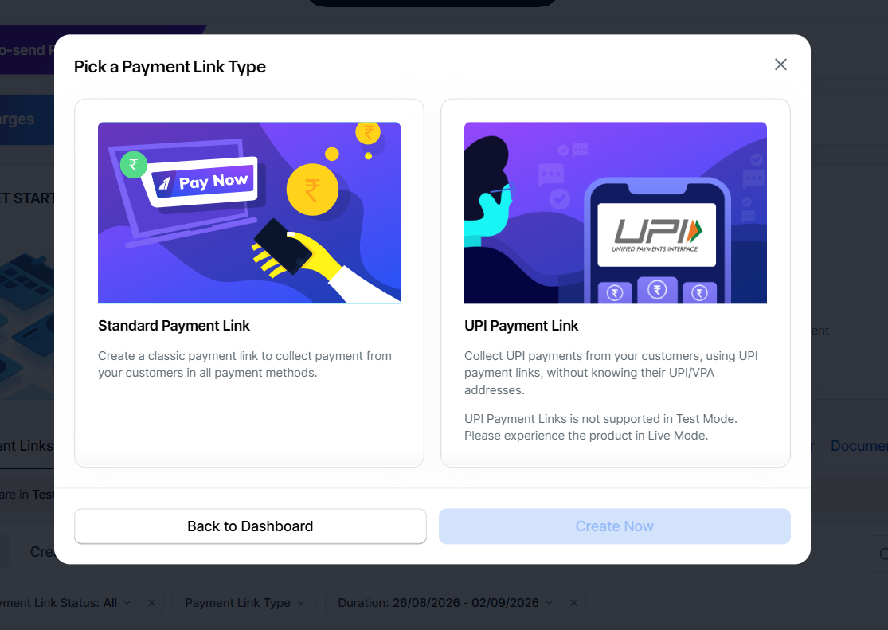
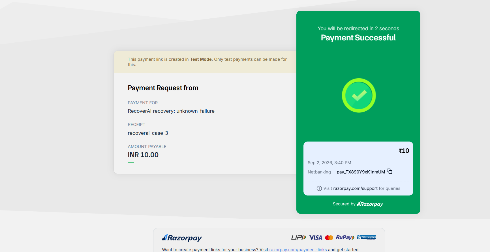

<p align="center">
  
</p>

<h1 align="center">RecoverAI</h1>

<p align="center">
  <b>Autonomous Revenue Recovery Agent for Razorpay</b><br/>
  Detects failed payments · diagnoses <i>why</i> · picks a bounded recovery action · executes it on Razorpay Test Mode · proves how much revenue it actually recovered.
</p>

<p align="center">
  Built for the Razorpay AI Buildathon · <b>Track 3 — Autonomous Agents</b>.
</p>

---

## Screenshots

### Operations dashboard
KPI row with a hero recovered-revenue tile, live agent status, cases table with per-case confidence bars, AI decision breakdown, recovery funnel, and a live activity feed.



### Case drawer — AI reasoning, exposed
Click any case → the drawer shows the diagnosis + confidence, the reason the agent picked *this* action, the real Razorpay Payment Link it generated, and the full recovery timeline.



### Recent agent activity
Every audit-log row across every case, sorted newest-first — detection, link creation, recovery — all clickable back into the drawer.



---

## Why this exists

Merchants don't just lose revenue when a payment fails. They lose it when the recovery *policy* doesn't adapt to *why* the payment failed. Retrying an expired card fails identically the second time. Retrying a gateway timeout usually works. Retrying an insufficient-funds error only works after the customer tops up. A single fixed retry loop is wrong for every one of these.

RecoverAI closes the loop: **detect → diagnose → decide (bounded) → execute → observe → measure → escalate → audit.**

## What it does

For every failed payment Razorpay sends:

1. **Ingests** the `payment.failed` webhook, verifies the HMAC signature, captures the structured error fields (`error_code`, `error_source`, `error_step`, `error_reason`) — not just the customer-facing description.
2. **Opens a recovery case** with the payment's revenue-at-risk.
3. **Diagnoses** the failure into one of 8 concrete classes: `transient_gateway_failure`, `insufficient_funds`, `invalid_instrument`, `authentication_failed`, `bank_declined`, `risk_declined`, `customer_action_required`, `unknown_failure`.
4. **Chooses an action** from a fixed allowlist: `retry`, `delayed_retry`, `payment_link`, `notify`, `escalate` — driven by the diagnosis, customer history (success rate, previous failures), and attempt number.
5. **Passes the action through a deterministic policy engine** (max 3 attempts, ₹50k ceiling, 60s cooldown, action allowlist, no-duplicate guard). The LLM proposes; policy disposes.
6. **Executes** — for `payment_link` this creates a real Razorpay Test Mode Payment Link; the customer's phone/email are notified.
7. **Waits for `payment_link.paid`** — when the customer pays, the case flips to `recovered`, `recovered_amount` is set, and the audit log records it.
8. **Escalates** when attempts are exhausted or the diagnosis is `risk_declined` — writes to `escalations.log` and (if configured) posts a Slack alert.
9. **Audits every step** — one JSON row per event, viewable per-case in the dashboard.

## Architecture

```
┌───────────────────────┐
│  Razorpay Test Mode   │
│  payment.failed /     │
│  payment_link.paid    │
└──────────┬────────────┘
           │  webhook (HMAC verified, idempotent by event_id)
           ▼
┌───────────────────────┐
│  FastAPI              │
│  /webhooks/razorpay   │  returns 200 in <50ms
└──────────┬────────────┘
           ▼
┌───────────────────────┐
│  BackgroundTasks      │  the recovery cycle runs async
└──────────┬────────────┘
           ▼
┌───────────────────────┐
│  Feature builder      │
│  (customer history,   │
│  amount, error fields)│
└──────────┬────────────┘
           ▼
┌───────────────────────┐
│  Agent                │  AgentDecision { diagnosis, confidence,
│  stub / claude / groq │    recommended_action, reason, message }
└──────────┬────────────┘
           ▼
┌───────────────────────┐
│  Policy engine        │  attempts · amount · cooldown · allowlist · stopped
└──────────┬────────────┘
           ▼
┌───────────────────────┐
│  Executor             │  → Razorpay Payment Link (real, Test Mode)
└──────────┬────────────┘
           ▼
┌───────────────────────┐
│  Case store + audit   │  SQLite via SQLAlchemy
└──────────┬────────────┘
           ▼
┌───────────────────────┐
│  Dashboard            │  /dashboard · /analytics/summary · /recovery/cases
└───────────────────────┘

── Parallel evaluation path ────────────────────────────
Synthetic batch (10k) ─► Baseline (always retry) ─┐
                     └─► RecoverAI (same agent)  ─┴─► Metrics
```

See [`docs/ARCHITECTURE.md`](docs/ARCHITECTURE.md) for the component-by-component breakdown.

## Track 3 checklist

| Requirement                            | Where it lives                                             |
| -------------------------------------- | ---------------------------------------------------------- |
| Detect revenue at risk                 | `app/routes/webhooks.py` → `open_case_for_payment`         |
| Diagnose the failure                   | `app/agent/stub_llm.py` (structured-error → diagnosis)     |
| Choose a bounded intervention          | `AgentDecision.recommended_action` (5-value enum)          |
| Guardrails / stop rules                | `app/services/policy.py` (attempts, amount, cooldown, allowlist) |
| Execute the action                     | `app/services/executor.py` → Razorpay Payment Link         |
| Observe outcome, close the loop        | `payment_link.paid` webhook → `mark_case_recovered_by_link` |
| Measure recovered revenue              | `/analytics/summary` and the dashboard hero tile           |
| Escalate/stop when attempts exhausted  | `run_recovery_cycle` → `case.status = "escalated"` + Slack |
| Full audit trail                       | `AuditLog` rows, viewable per-case                         |
| Webhook signature verification         | `_verify_signature` (HMAC-SHA256, enforced in prod)        |
| Webhook idempotency                    | `PaymentEvent.razorpay_event_id` unique index              |

## Results

10,000 synthetic failed-payment cases (see `scripts/simulator.py` and [`docs/BENCHMARK.md`](docs/BENCHMARK.md)):



| Metric               | Baseline (always retry) | RecoverAI     |
| -------------------- | ----------------------: | ------------: |
| Cases                |                  10,000 |        10,000 |
| Revenue at risk      |             ₹81,85,252 | ₹81,85,252   |
| Cases recovered      |                   3,317 |         7,749 |
| Revenue recovered    |             ₹27,54,230 | ₹63,32,124   |
| Recovery rate        |                   33.7% |         77.4% |
| Avg actions / case   |                    1.67 |          1.57 |
| Unnecessary actions  |                   7,637 |         4,018 |
| Escalated            |                   6,683 |         2,115 |
| **RecoverAI lift**   |                         | **+43.7 pp**  |

Numbers come from the synthetic simulator; see [`docs/BENCHMARK.md`](docs/BENCHMARK.md) for the ground-truth model and an honest reading.

## Unit economics

Every action costs something — an LLM decision, a Payment Link create, an SMS/email. `/analytics/summary` reports it as first-class metrics:

- `cost_inr` — cumulative cost across all actions
- `net_recovered_inr` — recovered revenue minus cost
- `cost_per_recovered_rupee` — the headline number, also shown live in the dashboard hero
- `roi_multiple` — recovered ÷ spent

Defaults (all env-tunable): ₹0.05 per LLM decision, ₹0.50 per Payment Link, ₹0.01 per simulated action. On the small real-mode sample so far, RecoverAI spends about **₹0.02 per ₹1 recovered — a ~50× ROI**.

## Live demo — end-to-end with Razorpay Test Mode

**1. A real Razorpay Test Mode payment fails**



**2. The agent diagnoses the failure and generates a real Payment Link**



**3. The customer pays the recovery link — case closes as `recovered`**



## Setup

Requires Python 3.10–3.13. On 3.13 you also need `pip install "setuptools<81"` because the Razorpay SDK still imports `pkg_resources`.

```bash
git clone <this repo>
cd Razor-Pay
python -m venv .venv
# Windows:  .venv\Scripts\activate
# macOS:    source .venv/bin/activate
pip install -r requirements.txt
cp .env.example .env
# Paste your Razorpay Test Mode key_id, key_secret, and webhook secret into .env
uvicorn app.main:app --reload
```

Open **http://127.0.0.1:8000/dashboard**.

### Wire Razorpay Test Mode

1. Dashboard → toggle **Test Mode** on → **Settings → API Keys → Generate Test Key**. Paste `key_id` + `key_secret` into `.env`.
2. Expose the local server: `ngrok http 8000` (or `cloudflared tunnel --url http://localhost:8000`).
3. **Settings → Webhooks → Add**:
   - URL: `https://<your-tunnel>/webhooks/razorpay`
   - Secret: any strong string; paste the *same* string into `.env` as `RAZORPAY_WEBHOOK_SECRET`.
   - Active events: `payment.failed`, `payment.captured`, `payment_link.paid`.
4. Restart uvicorn so it picks up the new secret.
5. Create a test Payment Link from the dashboard and pay it with fail card `4000 0000 0000 0002`.

### Seed the dashboard for a demo

Fires 3 varied failed payments (gateway timeout, insufficient funds, invalid card) at the local webhook so the dashboard has a mix of diagnoses and actions to show:

```bash
python scripts/seed_demo.py
```

The script signs the requests with `RAZORPAY_WEBHOOK_SECRET` so verification passes.

### Run the benchmark

```bash
python scripts/simulator.py --n 10000 --out benchmark_results.json
```

### Run the tests

```bash
pytest        # 16 tests: policy engine, stub agent, webhook smoke
```

## LLM

By default the agent uses `stub_llm` — deterministic, zero-cost, covers all 8 diagnoses. Two real-LLM adapters slot in behind the same `AgentDecision` schema, validated by the same policy engine:

- **Groq** (free, no card): `LLM_MODE=groq` + `GROQ_API_KEY` → Llama / GPT-OSS / Qwen via forced tool-use.
- **Anthropic Claude**: `LLM_MODE=anthropic` + `ANTHROPIC_API_KEY` → `claude-3-5-haiku-latest` via forced tool-use.

The router falls back to the stub on any error, so a rate-limited or offline LLM never breaks the live path.

## Failure handling & bounded autonomy

- **Attempt cap** — 3 per case, enforced in `policy.py`. Beyond that: `escalated`, no further automated action.
- **Amount ceiling** — actions above ₹50,000 are blocked.
- **Cooldown** — 60s minimum gap between actions on the same case; a burst of duplicate webhooks cannot exhaust the attempt budget in a second.
- **Action allowlist** — the LLM cannot invent an action; `AgentDecision.recommended_action` is a 5-value Literal, and policy re-validates against a hard-coded set.
- **Risk-declined → straight to escalate** — no retrying suspected fraud.
- **Webhook signature** — HMAC-SHA256 verified when `RAZORPAY_WEBHOOK_SECRET` is set; bad signatures return 400.
- **Webhook idempotency** — `PaymentEvent.razorpay_event_id` is unique-indexed; a retry of the same delivery returns `{"duplicate": true}` with no side effects.
- **Non-blocking webhooks** — the recovery cycle runs on a FastAPI `BackgroundTasks` queue; the webhook returns 200 in <50ms so Razorpay never times out on a slow LLM call or Payment Link creation.
- **Escalation to a human** — on transition to `escalated`, `app/services/escalation.py` writes to `escalations.log` and (if `ESCALATION_WEBHOOK_URL` is set) posts a Slack alert with the case id, amount, diagnosis, attempts, and reason.
- **Payment Link is idempotent from the customer's perspective** — creating a fresh link never charges twice; a duplicate webhook cannot cause a double-charge.
- **`.env` gitignored** — no credentials in the repo.

## Repo layout

```
app/
  main.py              FastAPI entrypoint
  config.py            env-driven settings
  db.py                SQLAlchemy engine + session
  models/entities.py   Customer · Payment · PaymentEvent · RecoveryCase · RecoveryAction · AuditLog
  agent/
    schema.py          AgentContext / AgentDecision (pydantic, 5-value action enum)
    stub_llm.py        deterministic diagnosis + action selection
    claude_llm.py      Anthropic Claude adapter (forced tool-use)
    groq_llm.py        Groq adapter (forced tool-use)
    router.py          stub / claude / groq switch with fallback
  services/
    policy.py          attempts · amount · cooldown · allowlist · stopped-guard
    executor.py        real Razorpay Payment Link creation + simulated retry/notify
    razorpay_client.py thin lazy wrapper around the razorpay SDK
    cases.py           open case · run_recovery_cycle · mark_case_recovered_by_link
    escalation.py      Slack webhook + log file on escalated cases
  routes/
    webhooks.py        /webhooks/razorpay (HMAC + idempotency + background queue)
    analytics.py       /analytics/summary (KPIs + unit economics)
    cases.py           /recovery/cases[/{id}] (with expand=true bulk endpoint)
    dashboard.py       /dashboard (single-file HTML)
  static/
    dashboard.html     the operations console
scripts/
  simulator.py                     10k-case benchmark, baseline vs RecoverAI
  seed_demo.py                     3 pre-canned failed payments for a smooth demo
  simulate_failed_webhook.py       smoke test
tests/
  test_smoke.py · test_policy.py · test_agent.py
docs/
  ARCHITECTURE.md · BENCHMARK.md · VIDEO_SCRIPT.md
assets/
  screenshots + Razorpay logo
```

## Roadmap (deliberately not built)

- Multi-tenant (one merchant per install today)
- Per-merchant configurable policy (attempt cap, amount ceiling, allowed actions)
- Localized customer messages (Hindi/Tamil/etc. via LLM)
- Fraud loop — feed `risk_declined` cases into the merchant's fraud tooling
- Prompt caching on the LLM call (halves cost per decision at scale)
- A/B testing hooks — some cohorts on RecoverAI, others on baseline, measure lift in-flight
- Voice / WhatsApp channels for customer outreach

## License

MIT.
